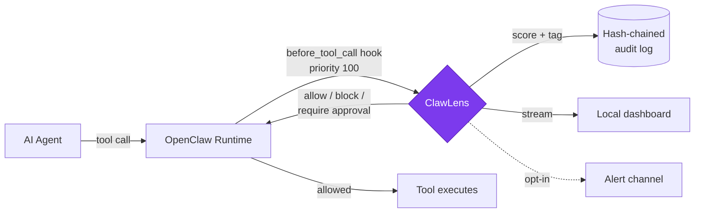

# raw.githubusercontent.com URL verification

Testing whether raw URLs render correctly on github.com README + are anonymously accessible.

## PNG image (agent close-up)

  

## SVG (Mermaid architecture diagram fallback)

  

## MP4 video (compressed demo)

  <video src="https://raw.githubusercontent.com/grepsoham/clawLens-preview/test/raw-url-verification/docs/assets/clawlens-demo.mp4" controls width="800">
    Your browser does not support inline video. <a href="https://raw.githubusercontent.com/grepsoham/clawLens-preview/test/raw-url-verification/docs/assets/clawlens-demo.mp4">Download the demo</a>.
  </video>

## Mermaid (native fenced block)

## What to check

1. PNG renders inline.
2. SVG renders inline.
3. Video player appears (click play to verify it streams).
4. Mermaid diagram renders as a flowchart (not a code block).
5. Clicking any image opens the raw asset in a new tab (not GitHub's file viewer).

If 1-4 all work in **incognito mode** (not logged into github.com), the approach is validated for ClawHub and any other anonymous renderer.
